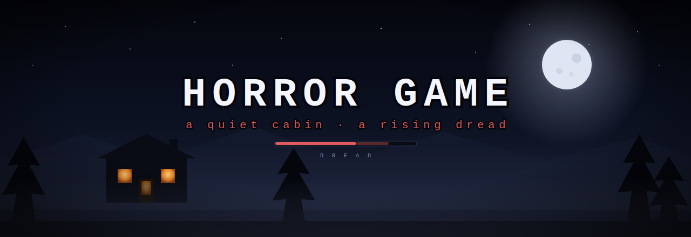
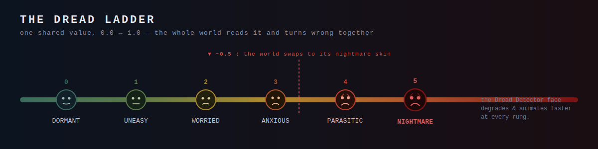
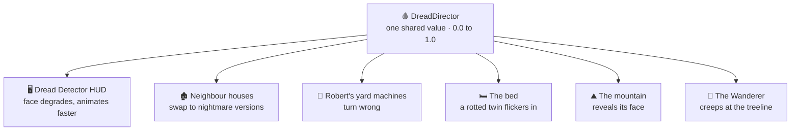
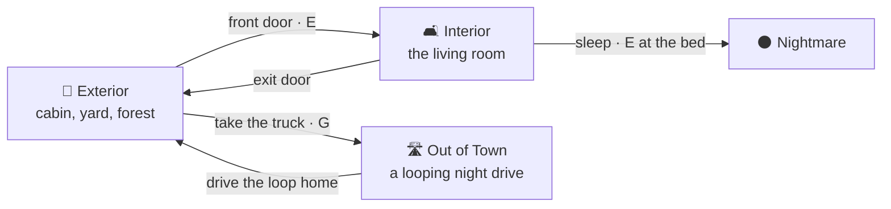

<!-- Banner -->
<div align="center">
  
</div>

<h1 align="center">Horror Game</h1>

<p align="center">
  <em>A 2.5D horror game about a cozy cabin in the woods — and the dread that quietly turns it wrong.</em>
</p>

<p align="center">
  
  
  
  
  
</p>

---

## The Idea

You live in a warm little log cabin, deep in an autumn forest ringed by far blue mountains.
There's a dog to pet, a fireplace to feed, a partner who talks to you, wood to chop, and a
truck in the driveway. It feels like a life.

<div align="center">
  
  <br>
  <sub>The cabin is the last comfort before the nightmare.</sub>
</div>

But underneath everything runs a single hidden number — **dread** — and as it climbs, the world
you trusted starts to answer differently. The neighbour's house wears a wrong face. The bed rots
when you blink. A figure you can't quite see drifts along the treeline. The horror here isn't a
jump-scare in a corridor; it's your own home slowly agreeing that something is off.

---

## 🩸 The Dread System

Dread is one shared value from `0.0` (calm) to `1.0` (nightmare), owned by a single
`DreadDirector`. Everything in the world *subscribes* to it — so the whole street can go wrong
**together**, in lockstep, instead of one scripted scare at a time.

The **Dread Detector** — a vitals-monitor face pinned to your HUD — is the player's read on that
number. It degrades through six named levels, animating slowly when you're calm and faster, with
more frames, as things get worse. It has three corruption "skins": **parasite**, **melt**, and
**fracture**.

<div align="center">
  
</div>

<div align="center">
  
  <br>
  <sub>The full <code>dread_master_atlas</code>: 3 corruption skins × 2 bodies × 6 levels × 4 frames — a face melting from human into something else.</sub>
</div>

When dread crosses roughly the halfway mark, the world itself flips to its nightmare skin:



> The **Wanderer** is the mood in miniature: a faint, near-black figure out among the distant
> trees that fades in, creeps sideways, and fades out on a random timer. It runs from the very
> start — not a scare, just the sense that you were never quite alone. The dread is in the timing.

---

## 🗺️ The World

Every scene is **built in code** by a procedural world generator (`HorrorGame3DSetup.cs`) — the
cabin, the forest, the neighbourhood and the drive are all assembled at edit time, then dressed
with sprites.



| Place | What's there |
|-------|--------------|
| 🏡 **The cabin & yard** | An 80×80 clearing with a real 3D log cabin, a cobble path, a dense ring of spruce (green up close, snowy far off), autumn dressing — bare trees, a bench, mushrooms, a crow, falling leaves — and a truck by the door. |
| 🛋️ **The living room** | A cozy interior: TV, bookshelf, an occupied sofa, a rug, side chairs, a working stone fireplace, the bed, and your dog and partner. |
| 🏚️ **The neighbourhood** | Neighbour plots along the path, including **Robert's** saltbox house — smoking chimney, a yard full of humming "tech-junk" machines. |
| 🛣️ **Out of town** | You arrive already driving: a long, straight, *looping* road under a full night sky, walled by giant redwoods, roadside dead trees and crows, with home visible far up the road. |

<div align="center">
  
  <br>
  <sub>The redwoods that wall the drive out of town.</sub>
</div>

---

## 🎮 What You Can Do

- 🪓 **Chop wood** — walk up to a spruce, swing an axe; the trunk notches, topples, and drops a log.
- 🔥 **Carry logs home & feed the fireplace** — it lights, burns down over about a minute, and its
  state persists across trips through the door.
- 🐕 **Pet the dog** — it plays a hearts reaction while your partner smiles.
- 💬 **Talk to your partner** — they idle, react, and speak lines to you.
- 🧍 **Customize your character** — cycle hair / skin / eyes / shirt / pants, pick a gender, and
  choose a boy or girl partner; it's saved and applied in-game.
- 📄 **Read notes** — pinned notes zoom from illegible-at-distance to a readable close-up.
- 🚚 **Drive the truck** — climb into a real first-person cockpit and take the road out of town.
- 🛏️ **Sleep** — lie down in the bed to cross into the nightmare.

<div align="center">
  
  <br>
  <sub>Get in, start the engine, and drive the loop.</sub>
</div>

### Controls

| Input | Action |
|-------|--------|
| `W` `A` `S` `D` | Move |
| Mouse | Look |
| `V` | Toggle first / third person |
| Hold `C` | Glance behind you |
| `E` | Interact — chop, open the cabin door, feed the fireplace, talk, read a note, sleep |
| `P` | Pet the dog |
| `E` → `F` → `G` | At the truck: open the door → start the engine → climb in |
| `G` | (driving, stopped) get out |
| `Esc` | Pause / Settings |
| `[` &nbsp;`]` | *Debug* — lower / raise dread |

---

## 👥 Who's Out There

- **You** — a customizable billboard character (look + gender chosen at the start).
- **Your partner** — a boy or girl who idles, smiles when the dog is happy, and speaks to you.
- **The dog** — an apricot / chocolate / cream companion (breed randomised at creation) that trots
  after you outdoors and hides once the nightmare begins.
- **Robert** — the neighbour, out front of his saltbox house; he turns to show his correct side as
  you circle him, and comes and goes from his home.
- **The Wanderer** — the distant, faint figure of background dread.
- **Wildlife** — a flock crossing the sky by day, crows along the road at night.

---

## 🧪 Under the Hood

- **2.5D billboards in a real 3D world** — characters and props are front/back/side sprite sheets
  that always face the camera and swap facing as you move around them, walking through actual 3D
  geometry.
- **Procedural scenes** — the exterior, interior and drive are rebuilt from
  `Assets/Editor/HorrorGame3DSetup.cs`, so the world is code, not a hand-placed scene file.
- **A shared dread bus** — one `DreadDirector` value drives the HUD face, house/prop swaps, the
  bed, the mountain and the Wanderer, so escalation is global and consistent.
- **A living sky** — a moving sun and moon, day→night lighting, birdsong that fades at dusk, and
  camera-following mountain rings that keep the peaks forever distant on the drive.
- **Surface-aware audio** — footsteps change over grass, the wooden cabin floor, and the asphalt road.

**Built with:** Unity `6000.5.1f1` · Universal Render Pipeline · the new Input System · C#.

---

## 🚀 Running It

> **Requires [Git LFS](https://git-lfs.com/).** The art lives in LFS — clone with it installed, or
> the sprites will come down as pointer files.

```bash
git lfs install
git clone https://github.com/HackMan617/Horror-Game.git
```

1. Open the project in **Unity 6000.5.1f1** (Unity 6.5) via Unity Hub.
2. Open the **`MainMenu`** scene (`Assets/Scenes/`) and press **Play** — or jump straight into
   `Sandbox3D` (interior) / `Exterior` (yard) to explore.
3. The world builds itself on load; use `[` and `]` to raise and lower dread while you look around.

---

## 📌 Status & Roadmap

This is an in-development prototype. The world, mechanics and the dread *plumbing* are in place;
the escalation that drives them is still being authored.

- [ ] **Automatic dread escalation** — days survived, story beats, proximity and time-in-nightmare
      (dread is currently driven manually / by debug keys).
- [ ] **The nightmare threat** — the nightmare is a lighting-and-mood transition today; the thing
      that hunts you there comes later.
- [ ] **A written story** — beyond the cozy-home-to-nightmare loop.
- [ ] **Control rebinding** — input is currently hardcoded (a sound-lock horror hook is already wired).

---

<p align="center"><sub>🌲 a quiet cabin · a rising dread 🌑</sub></p>
